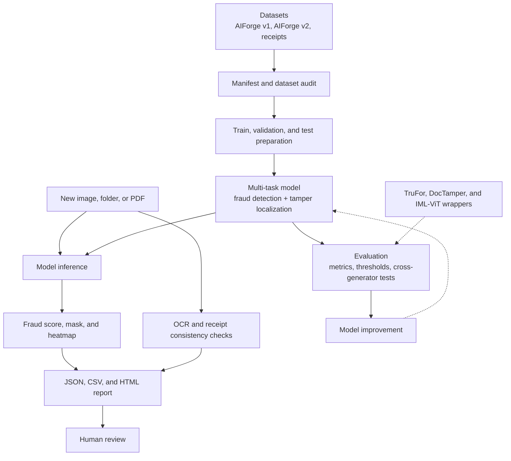

# Multi-Generator Deepfake Document Detection and Tamper Localization

An end-to-end research prototype for detecting AI-generated or manipulated
documents, localizing suspicious pixels, testing cross-generator robustness,
and producing reviewable evidence artifacts for images, folders, and PDFs.

Repository root: the directory containing this `README.md`

Dataset root: configurable; the default expects datasets beside this repository

Validated hardware: NVIDIA GeForce RTX 3050 Laptop GPU with 4 GB VRAM

## Project Status

The project is operational as a local research pipeline. The completed work
includes:

- A trained two-head baseline for document-level fraud classification and
  pixel-level tamper localization.
- Configurable SegFormer-lite, ConvNeXt, Swin, and Hugging Face SegFormer
  model implementations.
- Two completed two-epoch cross-dataset SegFormer-lite studies.
- Official-repository interfaces for TruFor, DocTamper, and IML-ViT; their
  repositories and checkpoints are downloaded separately and excluded from Git.
- Image, folder, and PDF inference with masks, heatmap overlays, JSON, CSV,
  and HTML outputs.
- OCR-assisted receipt checks using Tesseract when installed and a
  project-local EasyOCR fallback otherwise.

This is not yet a production fraud decision system. The main local checkpoint
was intentionally trained for only two epochs, and the external research
baselines have not been numerically benchmarked in their native environments.
The limitations and metric interpretation are documented below.

## Research Objective

Most simple deepfake detectors return one score for an entire image. That is
not enough for document review, where an analyst also needs to know where the
suspected edit occurred and whether the model generalizes beyond the generator
seen during training.

This project therefore addresses four connected questions:

1. Can one model classify a document as authentic or forged?
2. Can it localize small manipulated regions at pixel level?
3. Does it transfer across different document generators and datasets?
4. Can the result be packaged into evidence artifacts that a human can review?

## Project Blueprint



## What Is Novel in This Implementation

The novelty is in the integrated experimental design rather than a claim of a
new published architecture:

- **Joint detection and localization:** one pipeline produces both a
  document-level fraud score and a pixel-level tamper map.
- **Multi-generator data model:** manifests retain dataset, generator, task,
  label, mask, and text provenance so results can be grouped by source.
- **Cross-generator stress testing:** separate v1-to-v2 and v2-to-v1 training
  studies test whether the model learns transferable forensic evidence or
  source-specific artifacts.
- **Visual and textual evidence:** image predictions are combined in the
  report with OCR-derived receipt consistency warnings. The current version
  reports these signals side by side; it does not yet learn a fused risk score.
- **Resource-aware design:** the local pipeline uses 512-pixel inputs, batch
  size 1, gradient accumulation, and mixed precision to run on 4 GB VRAM.
- **Reproducible external interfaces:** official TruFor, DocTamper, and IML-ViT
  assets are tracked locally without inventing comparison results that have
  not been produced in their required environments.

## Dataset

### Sources

| Dataset | Local role | Important characteristics |
|---|---|---|
| AIForge-Doc-v1 | Classification and localization | Authentic documents, forged documents, masks, Gemini Nano and Qwen inpainting sources |
| AIForge-Doc-v2 | Localization and generator-shift evaluation | 3,066 GPT-Image-2 forged documents with masks; the local copy has no authentic folder |
| gpt4o-receipt | Generated receipt classification and text checks | 776 images, 764 text files, and 608 matched image/text pairs |

### Manifest Audit

| Statistic | Value |
|---|---:|
| Total usable rows | 11,962 |
| Training rows | 8,428 |
| Validation rows | 1,192 |
| Test rows | 2,342 |
| Forged/generated labels | 7,900 |
| Authentic labels | 4,062 |
| Tamper-localization rows | 7,126 |
| Image-classification rows | 4,060 |
| Generated-receipt rows | 776 |

One AIForge-Doc-v1 row was skipped because its mask existed but its image was
missing. The generated manifests contain no remaining missing file references.

The audit also shows that tampered regions are very small. In the sampled
splits, median positive-mask coverage is approximately 0.38% to 0.55% of the
image. This severe pixel imbalance is why raw pixel accuracy is not a reliable
headline metric.

Generated manifest files:

- `data\manifests\all_samples.csv`
- `data\manifests\train.csv`
- `data\manifests\val.csv`
- `data\manifests\test.csv`
- `data\manifests\manifest_summary.json`

## Datasets and Citations

This project does not claim ownership of the datasets. If you use this
repository, its checkpoints, or its reported results in academic work, cite
the dataset versions that contributed to your experiment.

| Dataset | Official source or paper | Citation status | Usage terms used by this project |
|---|---|---|---|
| AIForge-Doc v1 | [Scam.AI AIForge-Doc repository](https://github.com/scamai/aiforge-doc) | Dataset paper under submission; dataset-card citation below | Non-commercial research and attribution |
| AIForge-Doc v2 | [GPT-Image-2 document-forgery repository](https://github.com/scamai/gpt_image2_doc_forgery_paper) | Dataset paper under submission; dataset-card citation below | Non-commercial research and attribution |
| GPT4o-Receipt | [GPT4o-Receipt paper, arXiv:2603.11442](https://arxiv.org/abs/2603.11442) | Public arXiv paper | CC BY-NC-SA 4.0 |

### AIForge-Doc v1

The local dataset card supplies the following citation. Its original URL is a
placeholder, so the entry below uses the Scam.AI repository referenced by the
AIForge-Doc v2 card.

```bibtex
@dataset{aiforgedoc2026,
  title = {{AIForge-Doc}: A Benchmark of AI-Forged Document Images},
  year  = {2026},
  note  = {Dataset paper under submission},
  url   = {https://github.com/scamai/aiforge-doc}
}
```

### AIForge-Doc v2

```bibtex
@dataset{aiforgedoc2v2026,
  title  = {{AIForge-Doc} v2: A Paired Benchmark of GPT-Image-2 Document Forgeries},
  author = {Wu, Jiaqi and Zhou, Yuchen and Tsang Ng, Dennis and Shen, Xingyu and
            Zewde, Kidus and Raj, Ankit and Duong, Tommy and Ren, Simiao},
  year   = {2026},
  note   = {Dataset paper under submission},
  url    = {https://github.com/scamai/gpt_image2_doc_forgery_paper}
}
```

### GPT4o-Receipt

```bibtex
@misc{zhang2026gpt4oreceipt,
  title         = {{GPT4o-Receipt}: A Dataset and Human Study for
                   {AI}-Generated Document Forensics},
  author        = {Zhang, Yan and Ren, Simiao and Raj, Ankit and Wei, En and
                   Ng, Dennis and Shen, Alex and Xue, Jiayu and
                   Zhang, Yuxin and Marotta, Evelyn},
  year          = {2026},
  month         = mar,
  eprint        = {2603.11442},
  archivePrefix = {arXiv},
  primaryClass  = {cs.AI},
  url           = {https://arxiv.org/abs/2603.11442}
}
```

### License and Source-Corpus Note

The local AIForge v1 and v2 cards are internally inconsistent: their YAML
metadata and gated access agreement specify `CC BY-NC-SA 4.0` and
non-commercial research use, while their README license sections also display
`CC BY 4.0`. This project follows the stricter non-commercial terms. Confirm
the current official dataset page before redistributing data, checkpoints, or
derived samples.

AIForge-Doc images are derived from CORD v2, WildReceipt, SROIE, and XFUND.
Those source corpora retain their own licenses and attribution requirements.
Consult the AIForge dataset cards and the original source-dataset pages when
publishing source-specific analysis or redistributing derived content.

## Method

### Preprocessing and Augmentation

- RGB images and grayscale masks are resized to `512 x 512`.
- Masks use nearest-neighbor resizing to preserve class boundaries.
- Training augmentation applies horizontal mirroring with probability 0.25
  and small brightness/contrast perturbations.
- Resizing occurs before augmentation to avoid allocating large intermediate
  images for source documents as large as 2304 x 4096.

### Fully Trained Local Baseline

The completed main checkpoint uses a compact four-level U-Net-style encoder
and decoder:

- Encoder channels: `32`, `64`, `128`, `256`.
- Decoder: transposed convolutions with skip connections.
- Segmentation head: one-channel pixel logit map.
- Classification head: global pooling over the deepest encoder feature map,
  followed by a small multilayer classifier.

The joint training objective is:

```text
total_loss = segmentation_weight * (weighted_pixel_BCE + Dice_loss)
           + classification_weight * classification_BCE
```

Completed-run settings:

| Setting | Value |
|---|---:|
| Input size | 512 x 512 |
| Batch size | 1 |
| Gradient accumulation | 8 steps |
| Optimizer | AdamW |
| Learning rate | 0.0002 |
| Weight decay | 0.00001 |
| Mask positive weight | 25.0 |
| Segmentation loss weight | 1.0 |
| Classification loss weight | 0.35 |
| Precision | CUDA mixed precision |
| Completed epochs | 2 |

### Implemented Model Options

Implementation status matters. A model being present in the codebase does not
mean it has a full, directly comparable benchmark.

| Model | Implementation | Current evidence |
|---|---|---|
| Tiny U-Net multitask | Local encoder, decoder, classification head | Fully trained for 2 epochs and evaluated on the 2,342-row combined test split |
| SegFormer-lite | Local hierarchical encoder and lightweight decoder | Forward/training smoke passed; two full 2-epoch cross-dataset studies completed |
| ConvNeXt Tiny | Torchvision backbone with segmentation and classification heads | Forward smoke passed; no full benchmark recorded |
| Swin-T | Torchvision backbone with segmentation and classification heads | Forward smoke passed; no full benchmark recorded |
| HF SegFormer B0 | Hugging Face SegFormer encoder with local heads | Forward smoke passed; no full benchmark recorded |
| TruFor | Official repository and final checkpoint downloaded | Wrapper and dry-run command available; native legacy environment still required |
| DocTamper | Official repository and four official weight files downloaded | Wrapper available; official evaluation expects LMDB datasets |
| IML-ViT | Official repository, checkpoint, and MAE pretraining weight downloaded | Wrapper available; official loader/notebook protocol still requires adaptation |

## Evaluation Strategy

The evaluator calculates:

- Document-level precision, recall, F1, IoU, accuracy, ROC-AUC, and PR-AUC.
- Pixel-level precision, recall, F1, IoU, and accuracy using streamed confusion
  counts, avoiding concatenation of every full-resolution pixel.
- Pixel ROC-AUC and PR-AUC from a bounded, reproducible sample of up to
  2.5 million pixels.
- Threshold sweeps for both classification and localization.
- Cross-dataset retraining studies to expose generator shift.

## Results

### Combined Held-Out Test Set

Checkpoint: `outputs\checkpoints\best.pt`

Test samples: `2,342`

| Level | Precision | Recall | F1 | IoU | Accuracy | ROC-AUC | PR-AUC |
|---|---:|---:|---:|---:|---:|---:|---:|
| Image | 0.6000 | 0.7877 | 0.6812 | 0.5165 | 0.5179 | 0.3784 | 0.5985 |
| Pixel at threshold 0.5 | 0.2600 | 0.4242 | 0.3224 | 0.1922 | 0.9886 | 0.8834 | 0.3406 |

The threshold sweep selected `0.7` for the strongest observed pixel F1:

| Pixel threshold | Precision | Recall | F1 | IoU | Accuracy |
|---:|---:|---:|---:|---:|---:|
| 0.7 | 0.3213 | 0.4040 | 0.3579 | 0.2180 | 0.9907 |

### Cross-Dataset SegFormer-Lite Studies

| Study | Test samples | Image F1 | Image ROC-AUC | Pixel F1 | Pixel IoU | Pixel ROC-AUC | Pixel PR-AUC |
|---|---:|---:|---:|---:|---:|---:|---:|
| Train AIForge v2, test AIForge v1 | 1,623 | 0.6669 | 0.5309 | 0.0444 | 0.0227 | 0.8035 | 0.0209 |
| Train AIForge v1, test AIForge v2 | 613 | 0.8290 | N/A | 0.0001 | 0.0001 | 0.7368 | 0.0229 |

Image ROC-AUC is unavailable in the second study because the local AIForge v2
test split contains only forged samples. Its image F1 therefore must not be
interpreted as balanced authentic-versus-forged discrimination.

The first direction has the inverse experimental weakness: AIForge v2 training
contains only forged samples. Its classification head cannot learn an
authentic-versus-forged boundary from that training subset. The v2-to-v1 study
is therefore most useful as a localization-transfer stress test, not as a fair
image-classification benchmark.

## Critical Interpretation

The results demonstrate a functional pipeline, but they also expose important
scientific weaknesses:

1. **Image F1 overstates classification quality.** The combined test image F1
   is 0.6812, but image ROC-AUC is 0.3784 and only 7 authentic samples were
   classified correctly at threshold 0.5. The classifier is strongly biased
   toward the forged class.
2. **Pixel accuracy is inflated by background pixels.** A value of 0.9886
   looks strong, but tampered pixels occupy well below 1% of many images.
   Pixel F1, IoU, and PR-AUC are more informative.
3. **Localization ranking is better than thresholded segmentation.** Pixel
   ROC-AUC is 0.8834, while pixel F1 is 0.3224 at threshold 0.5 and 0.3579 at
   threshold 0.7. The model often ranks suspicious regions correctly but is
   not yet precisely calibrated.
4. **Cross-generator localization does not generalize reliably.** Pixel F1
   falls to 0.0444 and 0.0001 in the two cross-dataset directions. This is the
   clearest evidence that the current models learn dataset-specific cues in
   addition to transferable tamper evidence.
5. **Two epochs are insufficient for convergence.** The training limit was a
   project time constraint, not an experimentally justified stopping point.
6. **Dataset composition introduces confounding.** AIForge v2 contributes
   forged examples without local authentic negatives, while authentic samples
   come mainly from AIForge v1. Dataset identity can therefore correlate with
   class identity.
7. **Missing masks are currently treated as negative masks.** Classification-
   only samples without localization annotations receive an all-zero mask, and
   segmentation loss is still calculated. For forged receipts without masks,
   this can create contradictory supervision. A future loss should ignore
   segmentation for rows without verified mask annotations.
8. **Checkpoint selection needs correction.** The current training loop writes
   the current epoch to `best.pt` before comparing its validation score with
   the previous best score. As a result, `best.pt` behaves like the latest
   completed epoch and is not guaranteed to be the best validation checkpoint.

These findings should be treated as the baseline for the next experiment, not
as a production accuracy claim.

## Receipt Fraud Module

The receipt module extracts monetary values and checks:

- Whether subtotal plus tax approximately equals the reported total.
- Whether the total is positive.
- Whether enough monetary values were detected for meaningful analysis.

Completed paired-text analysis:

- Text files analyzed: `608`
- Files with warnings: `1`

For unseen PDFs or images, the batch pipeline attempts Tesseract first and
falls back to EasyOCR. OCR text risk and visual model fraud score are stored as
separate report fields. They are not yet combined by a calibrated fusion model.

## Inference Outputs

Single-image prediction produces:

- Document fraud probability and binary label.
- Binary mask PNG.
- Red probability heatmap overlay PNG.
- JSON report with mask probability statistics and artifact paths.

Batch inference additionally produces:

- `batch_report.json`
- `batch_report.csv`
- `batch_report.html`
- OCR text files when OCR is enabled.

Verified product runs:

| Run | Inputs | Outcome |
|---|---:|---|
| AIForge v2 folder inference | 613 images | 594 predicted forged; JSON, CSV, HTML, masks, and overlays generated |
| PDF smoke without OCR | 2 pages | Both pages rendered and processed |
| PDF smoke with EasyOCR | 2 pages | OCR available on both pages and receipt warnings recorded |

## Repository Layout

```text
deepfake-document-detection/
|-- configs/                       Portable model configurations
|-- data/                          Local manifests (ignored) and layout guidance
|-- external/                      Local SOTA repos/checkpoints (ignored)
|-- outputs/                       Generated runs and reports (ignored)
|-- scripts/                       Command-line entry points
|-- src/ddfd/
|   |-- core.py                    Data, baseline, training, evaluation, prediction
|   |-- advanced_models.py         SegFormer, ConvNeXt, and Swin model options
|   |-- batch_inference.py         PDF, folder, OCR, and report pipeline
|   `-- sota_wrappers.py           Official external-repository interfaces
|-- pyproject.toml
|-- requirements-cuda.txt
|-- requirements.txt
`-- README.md
```

Raw datasets, generated manifests, model weights, external repositories, and
runtime outputs are deliberately not committed. See `data/README.md`,
`external/README.md`, and `outputs/README.md` for their expected layouts. A
public-release checklist is available in `docs/GITHUB_PUBLISHING.md`.

## Installation

From PowerShell:

```powershell
git clone <repository-url>
cd deepfake-document-detection
.\scripts\setup_env.ps1
```

The setup script:

1. Creates `.venv` if it does not exist.
2. Installs CUDA-enabled PyTorch and torchvision from the CUDA 12.6 index.
3. Installs the project dependencies.
4. Installs the package in editable mode.
5. Prints CUDA availability and the detected GPU.

The completed environment used:

- Python virtual environment under `.venv`.
- PyTorch `2.12.1+cu126`.
- torchvision `0.27.1+cu126`.
- CUDA mixed precision on the RTX 3050 Laptop GPU.

The external TruFor, DocTamper, and IML-ViT repositories may require separate
environments because their original dependency versions and dataset protocols
do not match the main project venv.

## Reproducing the Local Pipeline

### 1. Build Manifests

```powershell
.\.venv\Scripts\python.exe scripts\build_manifests.py --config configs\default.yaml
```

### 2. Audit the Dataset

```powershell
.\.venv\Scripts\python.exe scripts\audit_dataset.py --config configs\default.yaml
```

### 3. Train the Completed Baseline Configuration

Use `--epochs 2` to reproduce the time-boxed completed run. If `--epochs` is
omitted, `configs\default.yaml` currently requests 20 epochs.

```powershell
.\.venv\Scripts\python.exe scripts\train.py --config configs\default.yaml --epochs 2
```

### 4. Evaluate the Held-Out Test Set

```powershell
.\.venv\Scripts\python.exe scripts\evaluate.py `
  --config configs\default.yaml `
  --checkpoint outputs\checkpoints\best.pt `
  --split test
```

### 5. Train an Advanced Backbone

```powershell
.\.venv\Scripts\python.exe scripts\train.py --config configs\segformer_lite.yaml --epochs 2
.\.venv\Scripts\python.exe scripts\train.py --config configs\convnext_tiny.yaml --epochs 2
.\.venv\Scripts\python.exe scripts\train.py --config configs\swin_t.yaml --epochs 2
.\.venv\Scripts\python.exe scripts\train.py --config configs\hf_segformer_b0.yaml --epochs 2
```

On 4 GB VRAM, begin with SegFormer-lite. ConvNeXt, Swin, and pretrained Hugging
Face variants may require a smaller input size, gradient checkpointing, CPU
offloading, or a larger GPU for stable full training.

### 6. Run Cross-Dataset Studies

Generate the study manifests/configurations without training:

```powershell
.\.venv\Scripts\python.exe scripts\cross_dataset_studies.py --architecture segformer_lite
```

Run both two-epoch directions:

```powershell
.\.venv\Scripts\python.exe scripts\cross_dataset_studies.py --architecture segformer_lite --run
```

### 7. Predict One Image

```powershell
.\.venv\Scripts\python.exe scripts\predict.py `
  --config configs\default.yaml `
  --checkpoint outputs\checkpoints\best.pt `
  --image ..\AIForge-Doc-v2\TestingSet\images\000000001.png
```

### 8. Run Folder or PDF Inference

```powershell
.\.venv\Scripts\python.exe scripts\batch_infer.py `
  --config configs\default.yaml `
  --checkpoint outputs\checkpoints\best.pt `
  --input path\to\document_or_folder `
  --output-dir outputs\predictions\custom_batch
```

Use `--no-ocr` for visual-only batch processing. Use `--dpi 100` or another
lower value for faster PDF OCR on memory-constrained machines.

### 9. Analyze Paired Receipt Text

```powershell
.\.venv\Scripts\python.exe scripts\analyze_receipts.py --config configs\default.yaml
```

## Official Research Baseline Interfaces

Check local repo/checkpoint status:

```powershell
.\.venv\Scripts\python.exe scripts\sota_wrappers.py --status
```

Optional local path overrides:

- TruFor: `external\TruFor\TruFor_train_test`
- TruFor checkpoint:
  `external\TruFor\TruFor_train_test\pretrained_models\weights\trufor.pth.tar`
- DocTamper: `external\DocTamper\models`
- DocTamper checkpoint: `external\DocTamper\models\pths\dtd_doctamper.pth`
- IML-ViT: `external\IML-ViT`
- IML-ViT checkpoint: `external\IML-ViT\checkpoints\iml-vit_checkpoint.pth`

Optional environment-variable overrides:

- `TRUFOR_REPO`, `TRUFOR_CHECKPOINT`
- `DOCTAMPER_REPO`, `DOCTAMPER_CHECKPOINT`
- `IMLVIT_REPO`, `IMLVIT_CHECKPOINT`

Official sources:

- [TruFor](https://grip-unina.github.io/TruFor/)
- [DocTamper](https://github.com/qcf-568/DocTamper)
- [IML-ViT](https://github.com/SunnyHaze/IML-ViT)

Dry-run commands are recorded under `outputs\reports\sota_*_last_run.json`.
They verify path and command construction, not successful native-environment
inference. Do not cite those records as benchmark results.

## Important Operational Notes

### Production Checkpoint

- `outputs\checkpoints\best.pt` is the restored two-epoch full baseline.
- `outputs\checkpoints\epoch_002.pt` is its preserved epoch checkpoint.
- `outputs\checkpoints\smoke_epoch_001.pt` is a tiny smoke checkpoint and must
  not be used as the production model.

The filename `best.pt` is retained for pipeline compatibility. Because of the
checkpoint-selection issue described above, it should be interpreted as the
restored epoch-2 baseline, not as proof that epoch 2 had the best validation
score among all possible runs.

### Smoke-Test Warning

`scripts\smoke_test.py` calls the training function using the output paths from
the selected config. Running it with `configs\default.yaml` can overwrite
`outputs\checkpoints\best.pt`, `epoch_001.pt`, and top-level training reports.
Use a copied config with dedicated smoke output directories before running it.

The top-level `outputs\reports\training_history.json` and
`evaluation_val.json` currently reflect the final smoke verification, not the
original full baseline training history. Use the completion summary and
held-out test reports for authoritative final metrics.

## Generated Experiment Artifacts

The completed development run produced the following local artifacts. They are
excluded from Git because they contain large binaries or machine-specific
paths; the aggregate results are preserved in this README.

| Artifact | Purpose |
|---|---|
| `outputs\reports\PROJECT_COMPLETION_REPORT.md` | Current human-readable project status, metrics, limitations, and verification |
| `outputs\reports\PROJECT_COMPLETION_SUMMARY.json` | Current machine-readable completion summary |
| `outputs\reports\FINAL_PROJECT_SUMMARY.json` | Baseline dataset, test, threshold, and receipt summary |
| `outputs\reports\evaluation_test.json` | Baseline held-out test metrics |
| `outputs\reports\threshold_sweep.csv` | Threshold calibration results |
| `outputs\reports\cross_generator_analysis.json` | Generator-group analysis |
| `outputs\reports\study_train_v2_test_v1_segformer_lite\evaluation_test.json` | v2-to-v1 test metrics |
| `outputs\reports\study_train_v1_test_v2_segformer_lite\evaluation_test.json` | v1-to-v2 test metrics |
| `outputs\predictions\batch_v2_test\batch_report.html` | Full AIForge v2 folder inference report |
| `outputs\predictions\batch_pdf_smoke_ocr\batch_report.html` | Verified PDF and EasyOCR report |

`FINAL_PROJECT_REPORT.md` is the earlier baseline-stage report.
`PROJECT_COMPLETION_REPORT.md` is the authoritative current report.

## Limitations

- Training was deliberately limited to two epochs.
- The combined label distribution and generator distribution are imbalanced.
- AIForge v2 has no local authentic negatives, confounding source and label.
- Cross-study image metrics are affected by one-class training or testing.
- Tiny masks make accuracy misleading and threshold selection unstable.
- Cross-dataset pixel localization is currently poor.
- Classification-only rows without masks currently contribute all-negative
  segmentation targets instead of being excluded from segmentation loss.
- `best.pt` is not guaranteed to be the highest-scoring validation epoch until
  checkpoint-selection order is corrected.
- The receipt rules are lightweight and do not perform full accounting,
  merchant-template, typography, or semantic consistency validation.
- OCR quality depends on scan resolution, orientation, language, and layout.
- External SOTA repositories require native environment adaptation before a
  fair numerical comparison can be reported.
- A model prediction is not legal proof of document fraud.

## Recommended Next Experiments

1. Correct best-checkpoint selection and preserve immutable run-specific
   output directories.
2. Mask segmentation loss for samples without verified localization labels.
3. Train for 10 to 20 epochs with early stopping and repeated seeds.
4. Add focal/Tversky or boundary-aware loss for tiny manipulated regions.
5. Calibrate image and pixel thresholds separately per validation domain.
6. Create balanced authentic and forged splits for every generator family.
7. Add JPEG recompression, rescaling, blur, print-scan, and screenshot
   augmentation to test operational robustness.
8. Adapt DocTamper and IML-ViT loaders to the common project manifest and run
   reproducible numeric comparisons.
9. Build a dedicated compatible TruFor environment and evaluate the same held-
   out samples.
10. Learn a calibrated fusion model over visual score, OCR confidence, receipt
   arithmetic, layout, and suspicious-region statistics.
11. Report confidence intervals instead of relying on one time-boxed run.

## Intended Use

This repository is intended for defensive research, model comparison, and
human-assisted document review. It should not be used as the sole basis for
rejecting an identity document, financial claim, application, or transaction.
Operational deployment requires privacy controls, jurisdiction-specific legal
review, representative validation data, calibrated thresholds, monitoring,
and a human appeal process.
